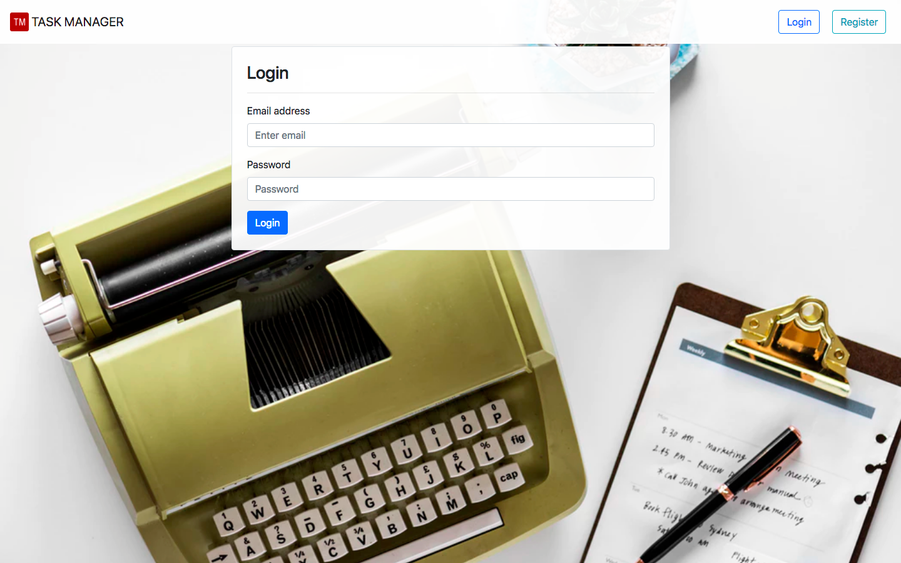
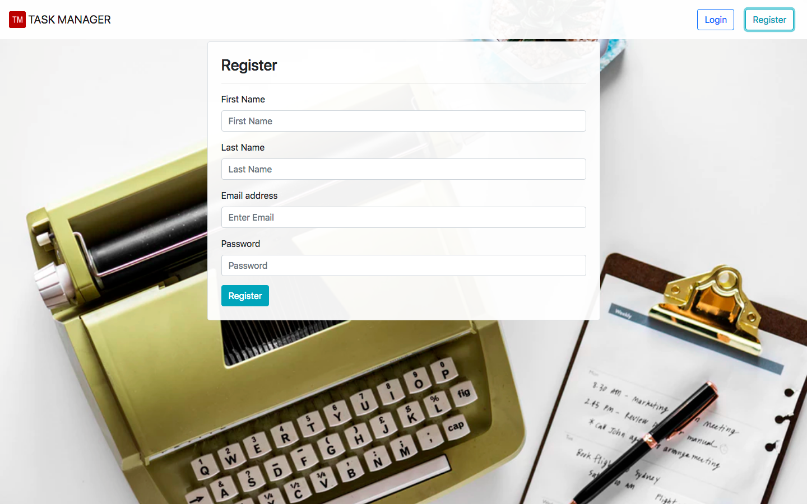
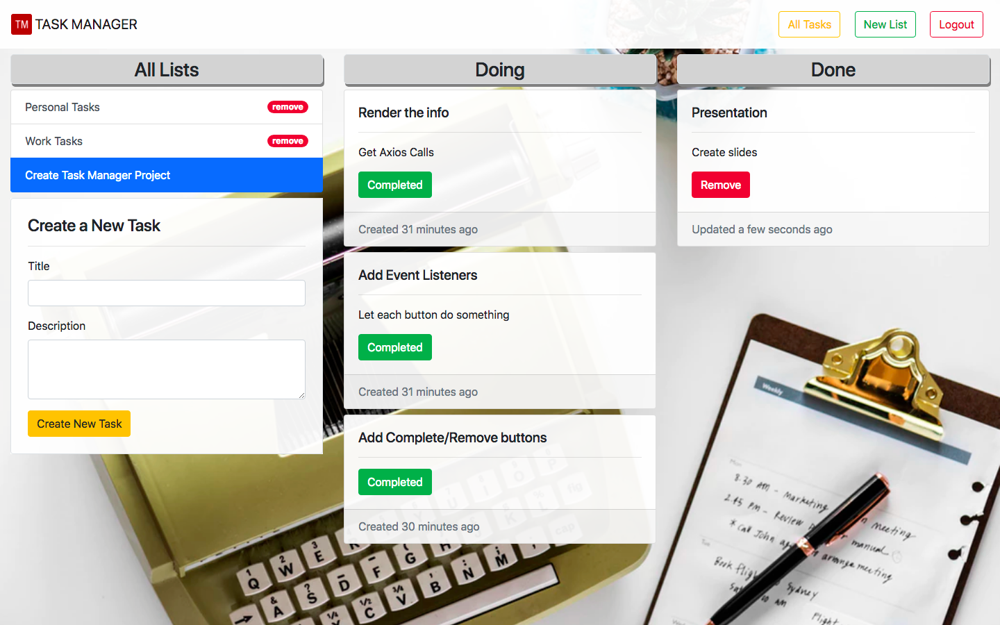

# Task Manager

Task Manager is a fully-featured Full-Stack project designed to demonstrate how to implement authentication and authorization.

This application allows users to create unique accounts, create multiple task lists, and add individual tasks to the aforementioned lists. Users also have the opportunity to mark tasks as "completed" and remove lists and tasks altogether. Each set of created lists are uniquely assigned and saved to the user's account, and a username and password will be required to access the information.

Task Manager uses DOM manipulation, authentication, authorization, and axios calls in the front-end design. The front-end is deployed to Surge, while the back-end is deployed to Heroku.

## Pages





## Key Features

* Login page allows existing user to login and provides an error if any of the information is invalid
* Register page allows a new user to register and provides error handling for registeration if any of the information is missing or the email has been registered with another account
* When a user successfully registers, they will be automatically logged in and prompted to create their first list
* When a user returns to the page and still has a valid token, they are logged in, and presented with a page that shows all their lists
* Users can navigate between lists and tasks
* Users can create and delete lists
* Users can create, complete, and delete tasks
* Users are provided with an error for creating new lists or tasks if the title is missing
* Users can not access information for another user's lists and will automatically logout if they enter the wrong list id in the URL

## Getting Started

These instructions will get you a copy of the project up and running on your local machine for development and testing purposes. See deployment for notes on how to deploy the project on a live system.

### The Backend

The backend can be found at: https://whispering-shore-93216.herokuapp.com

### Installation

What things you need to install the software and how to install them
```shell
* Fork and/or Clone this repository
* `npm install`
* `npm run dev`
```

## Deployment

This project has been deployed on surge: [taskmanagerwb.surge.sh](taskmanagerwb.surge.sh)

## Built With

* [Bootstrap](https://getbootstrap.com/)
* [Axios](https://www.npmjs.com/package/axios)
* [Browserify](http://browserify.org/)
* [Watchify](https://www.npmjs.com/package/watchify)
* [Live-server](https://www.npmjs.com/package/live-server)
* [Moment](https://momentjs.com/)

## Contributing

Please send either of the developers a message for details on our code of conduct, and the process for submitting pull requests.

## Authors

* **Wendy Parsons** wsparsons@gmail.com
* **Brandon Yu** brandoncyu@gmail.com
